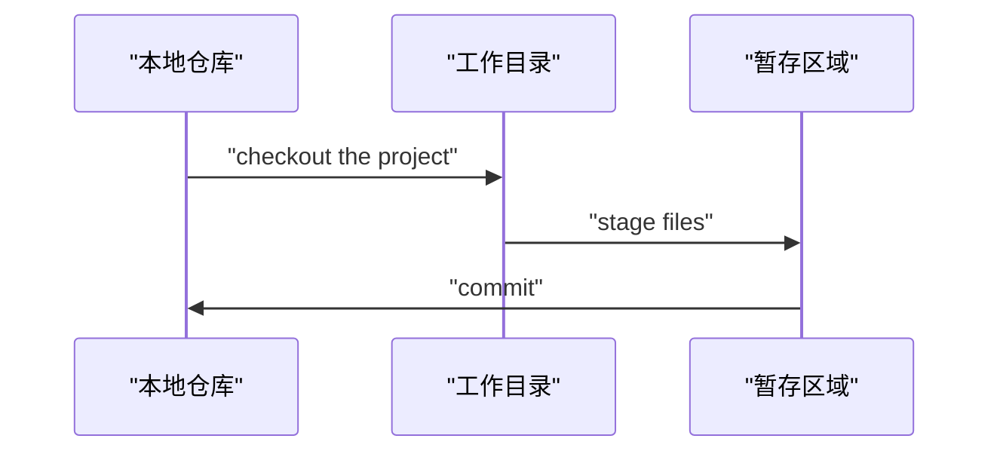

Git和其他版本控制系统的主要差别在于， GIt只关心文件数据的整体是否发生变化， 而大多数其他系统则只关心文件内容的具体差异。

### 版本控制
版本控制是一种记录一个或若干文件内容变化，以便将来查阅特定版本修订情况的系统。


### 基础知识
##### 文件的三种状态
对于任何一个文件，在GIt内部只有三种状态：
- 已提交 (commit)
	- 文件已被安全地保存到本地数据库中
- 已修改 (modified)
	- 修改了某个文件，但还没有提交保存
- 已暂存 (staged)
	- 把已修改的文件放在下次提交时要保存的清单中

Git管理项目时， 文件流转的三个工作区域：
- Git的工作目录
- 暂存区域
- 本地仓库



每个项目都有一个Git目录 (.git目录)，它是Git用来保存元数据和对象数据库的地方。该目录非常重要，每次克隆镜像仓库的时候，实际拷贝的就是这个目录里面的数据。
从项目中取出某个版本的所有文件和目录，用以开始后续工作的叫做工作目录。这些文件世纪上都是从Git目录中的压缩对象数据库中提取出来的，接下来就可以在工作目录中对这些文件进行编辑。
	暂存区域只不过是一个简单的文件，一般都放在Git目录中。

基本的Git工作流程如下：
- 对工作目录中修改某些文件
- 对修改后的文件进行快照，然后保存到暂存区域
- 提交更新，将保存在暂存区域的我呢间快照永久转储到Git目录中


### Git安装
安装Git主要有两种方式：
1. 通过编译源代码安装；
2. 使用为特定平台编译好的安装报。

##### 从源代码安装
Git的工作需要调用 curl, zlib, openssl, expat, libiconv等库的代码，因此需要先安装这些依赖工具。
```bash
apt-get install libcurl4-gnutls-dev libexpat1-dev gettext \
libz-dev libssl-dev
```
然后，从Git官方站点下载最新的源代码：
http://git-scm.com/download
然后编译并安装：
```bash
tar -zxf git-1.7.2.2.tar.gz
cd git-1.7.2.2
make prefix=/usr/local all
sudo make prefix=/usr/local install
```
这样就能使用git命令了，用git将Git项目仓库克隆到本地，以便日后随时更新：
```bash
git clone git://git.kernel.org/pub/scm/git/git.git
```

##### 在Linux上安装
直接通过系统提供的包管理工具:
Fedora上用yum安装：
```bash
yum install git-core
```
Ubuntu这类Debian体系的系统上：
```bash
apt-get install git
```


### 初次运行前的配置
Git提供了 git config 工具，专门用来配置或读取相应的工作环境变量。这些环境变量，决定了Git在各个环节的具体工作方式和行为：
- /etc/gitconfig文件
	- 系统中对所有用户都普遍适用的配置
	- git config 时用 --system选项，读取的就是这个文件。
- ~/.gitconfig文件
	- 用户目录下的配置文件， 只适用该用户。
	- git config 时用 --global选项，读取的就是这个文件。
- 当前项目的Git目录中的配置文件(工作目录中的 .git/config文件)
	- 这里的配置仅针对当前项目有效。
每个级别的配置都会覆盖上层的相同配置， .git/config里的配置优先级最高！

在windows系统， Git会寻找用户主目录下的 .gitconfig文件。主目录即 $HOME 变量指定的目录，一般是 C:\Documents and Settings\$USER;
此外，Git还会尝试找寻 /etc/gitconfig 文件，以Git安装目录作为根目录定位。

##### 用户信息
第一个要配置的是个人的用户名称和电子邮件地址。这两条配置很重要，每次Git提交时都会引用这两条信息，说明是谁提交了更新，所以会随更新内容一起被永久纳入历史记录：
```bash
git config --global user.name "fanfantingfeng"
git config --global user.email 1036745994@qq.com
```
如果用了 --global选项，那么更改的配置文件就是位于你用户主目录下的那个，以后所有的项目都会默认使用这里的用户信息。
如果要在某个特定的项目中使用其他名字或者邮件地址，只要去掉 --global 选项重新配置即可，新的设定保存在当前项目的 .git/config 文件里。

##### 文本编辑器
设置默认使用的文本编辑器。Git需要你输入一些额外消息的时候，会自动调用一个外部文本编辑器供你使用：
```bash
git config --global core.editor emacs
```

##### 差异分析工具
在解决合并冲突时，使用哪种差异分析工具，比如要改用vimdiff的话：
```bash
git config --global merge.tool vimdiff
```
Git可以理解 kdiff3, tkdiff, meld, xxdiff, emerge, vimdiff, gvimdiff, ecmerge, opendiff等合并工具的输出信息。

##### 查看配置信息
查看已有的配置信息，使用 git config --list 命令：
```bash
git config --list
```
有时候会看到重复的变量名，说明它们来自不同的配置文件，Git实际采用的是最后一个。
也可以直接查阅某个环境变量的设定，只要把特定的名字跟在后面即可：
```bash
git config user.name
```

### 获取帮助
阅读Git各式工具的使用帮助，有三种方法：
```bash
git help <verb>
git <verb> --help
man git-<verb>
```
默认情况下，获取帮助不需要联网。


下一节： [[2.git基础操作]]